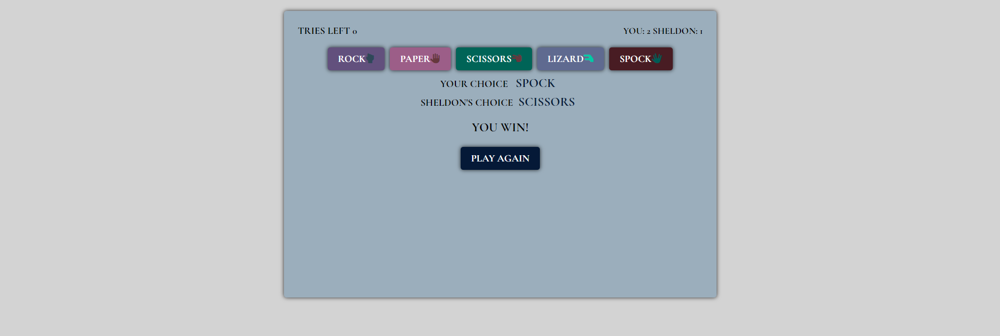
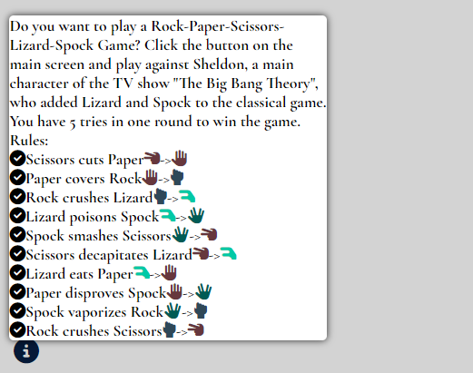
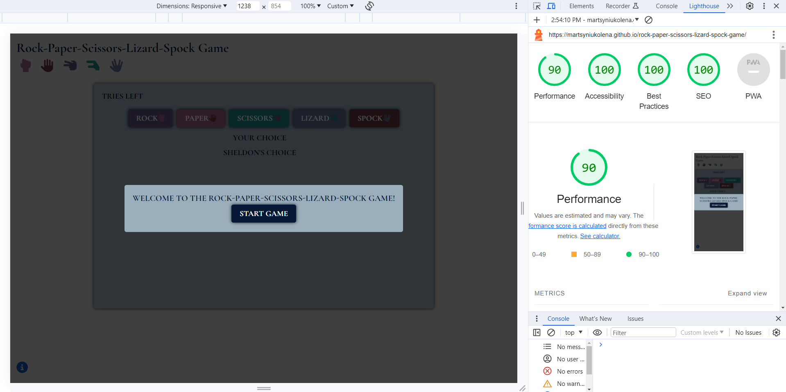
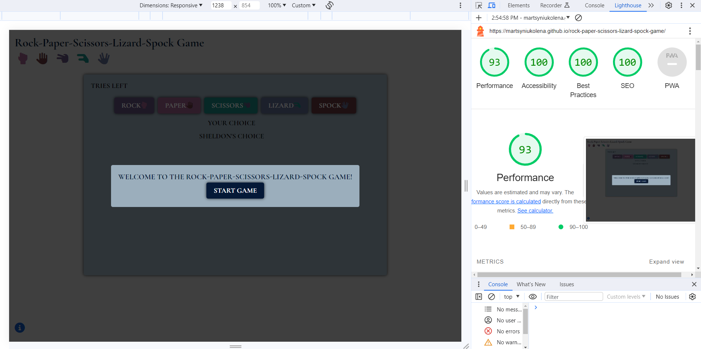
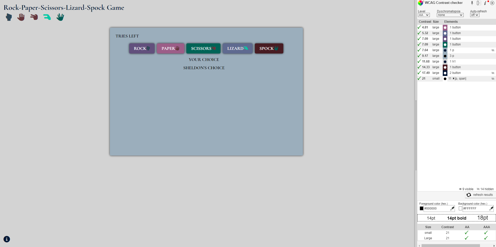
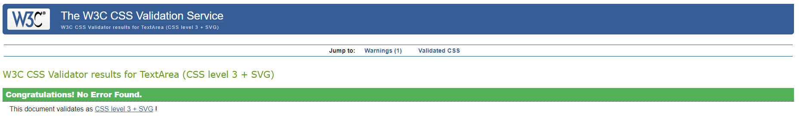
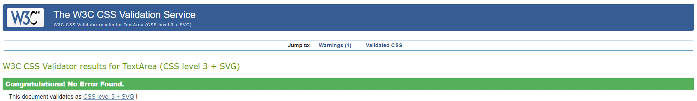
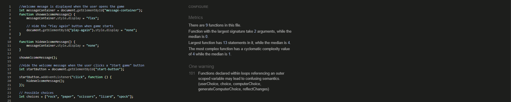

# Rock-Paper-Scissors-Lizard-Spock Game (RPSLS)

The Rock-Paper-Scissors-Lizard-Spock Game is an entertaining game designed to bring a fresh twist to the classic Rock-Paper-Scissors game. The project aims to provide a fun and interactive experience for players of all ages who enjoy casual gaming. RPSLS is a game of luck and chance.

The game fosters strategic thinking, decision-making, and quick reflexes, making it a valuable learning tool for children and an engaging activity for adults. The game encourages critical thinking and anticipation of opponents' moves. It accessible on various platforms, from smartphones to web browsers.

>Business Goals:

1. To engage users with the RPSLS game and encourage them to visit and play regularly.

2. To provide an enjoyable and user-friendly RPSLS game that meets user needs.

3. To introduce unique features of the RPSLS game to stand out in the market.

>User Needs:

1. To play the Rock-Paper-Scissors-Lizard-Spock game for entertainment and leisure.

2. The game serves as a tool for resolving decisions or disputes between users fairly and randomly.

3. To improve skills and strategies with the help of a game.

___

## Features

The Rock-Paper-Scissors-Lizard-Spock Game offers several key features for its users.

### Existing Features

__Welcome Message:__

When a user starts a game, the first thing they see is a welcome message and a start button. This area serves as an entry point, welcoming users to the game and offering them a clear starting point, enhancing user experience. The user can start a game after pressing the start button.

___
__Header:__

The header  displays the games's title, "Rock-Paper-Scissors-Lizard-Spock Game," along with an illustrative icons to create an engaging introduction. The value here lies in capturing the user's attention and conveying the essence of the game.

___
__Main Game Area:__

This section is the heart of the project. The value of this area is to offer an interactive gaming experience where users can play, enjoy the game's dynamics, and track their progress.

___
__Buttons (Rock, Paper, Scissors, Lizard, Spock):__

- Buttons represent the player's choices in a RPSLS game. They allow the user to select their move to play against the computer.
- These buttons make the game interactive and engaging for the user, as they are the core elements for playing and provide the means for active participation.

___
__Tries and Score:__

- "Tries left" and "Score" are textual elements that display information related to the game's progress. They are placed at the top of the game container.
- "Tries left" shows how many attempts the user has remaining. The maximum amount of tries is five. After each selection, tries are subtracted.
- "Score" keeps track of the user's and computer's points.
- These elements help to keep track of performance and encourage to play multiple rounds.

___
__User's and Computer's Choice:__

- "Your Choice" and "Computer's Choice" are text elements that display the choices made by the user and the computer.
- "Computer's Choice" is replaced by "Sheldon Choice". It is a thematic choice. Sheldon is a fan of Rock-Paper-Scissors-Lizard-Spock Game, whose idia was to add two more elements (Spock and Lizard) to the classical game.
 The purpose is to add an entertaining touch to the game to make the game more engaging.
- These elements provide transparency by showing what moves the user and the computer have selected for a particular round, enhancing the user's understanding of the game's outcome.

___
__Results:__

- The "result" element is where the game's outcome is displayed (You win!, Sheldon wins!, or It is a tie!).
- This feature provides instant feedback to the user about the result of the current game round, contributing to their engagement and understanding of the game's progress.

___
__Alert Notification:__

- This function is used to determine the outcome of a game and then display a message to the user based on the result.
- It compares the user's score and the computer's score to see who has won or if it's a tie. It is a crucial feature because it finalises the game round and informs the user of the final result.

___
__Play-Again Button:__

- The "Play Again" button allows you to start a new game round after the current round has concluded. Other buttons are disabled.
- This feature offers convenience and encourages you to continue playing, ensuring an enjoyable gaming experience.
- The "Play-Again" button ensures a smooth and continuous gaming experience.

___

__Footer (Information Section):__

The footer offers additional information to users, explaining the rules and how to play the game, along with an illustrative icons. This feature ensures that even new users can quickly understand how to play the game, making it accessible to a wide range of individuals, including those who may not be familiar with the RPSSL game rules.

___

## Features Left to Implement

- users can enter their names;
- to display users' names instead of "you";
- to play with a real player;
- navigate through the game with a keyboard.

___

## Testing

I conducted the following testing:

__Functionality Testing:__

- Verified that all functionality works
- Tested the buttons and if the information displays as expected

Buttons allow the user to make a selection. The user's choice and the computer's choice are displayed correctly on the screen after each selection. The overal result of each selection is correctly displayed. The number of tries subtract after each selection. The score increases and decreases based on it is a win or lose. If it's a tie, the score remains unchanged. The computer's choice is generated randomly.

An alert message appears after the user has made five selections, indicating the final result of the game. The notification declares whether the user or the computer has won based on the overall score and if the result is a tie.

A "Play" button appears when the number of tries reaches zero, indicating that the game has ended. The user can click the "Play" button to start a new game with five fresh tries.

An information box appears when the user hovers or clicks (for mobile) on an icon, providing details about the game rules and how to play.
___
__Compatibility Testing:__

- I tested this game playing in different browsers - Chrome, Firefox, Edge
- I tested this game playing on desktop and mobile, Windows and Android

___
__Accessibility Testing:__

- Ensured the buttons have aria-label

___
__Performance Testing:__

Performance testing was done with Lighthouse.
The current results are the following:

Mobile

Desktop

___
I confirmed that the header, instructions, results, footer text are all readable and easy to understand.

I confirmed that the colors and fonts chosen are easy to read. I used WCAG to check the color contrast.

___

## Bugs

__Solved Bugs:__

- The aria label for scissors was corrected (it was paper)
- removed low-resolution logo and added rock, paper, scissors, spock, lizard icons
- changed colors for contrast on computer's and user's choices, buttons, icons
- JSHint showed to add missing semicolons
- Arrows were not displayed on the mobile version. They were replaced with hyphens and 'more than' signs

__The bugs left to fix__

No unfixed bugs.
___

## Validator Testing

HTML: No errors were found when passing through the W3C validator.

CSS: No errors were found when passing through the Jigsaw validator.

JSHint JavaScript Validator: No critical errors were found when passing through the JSHint.

___

## Deployment

The site was deployed to GitHub pages.

In the GitHub repository, go to Settings --> In the Code and automation section on the left side, Press Pages --> Under the Source, select 'Deploy from a branch' --> Under the Branch, select Main and press the Save button.
Refresh the page. The link will be at the top.

The live link can be found here - <https://martsyniukolena.github.io/rock-paper-scissors-lizard-spock-game/>
___

## Credits

Colors were generated at [MyColor Space](https://mycolor.space/?hex=%2331809A&sub=1) and were chosen randomly.

Favicon was downloaded at [Icons8](https://icons8.com/icons/set/choice).

Icons were downloaded from [Fontawesome](https://fontawesome.com/search).

To check grammar and edit text, I used [Grammarly](https://app.grammarly.com/).

I referenced the Love Maths project as a guide and Ultimate Rock Paper Scissors.

Game rules were copied from [The Big Bang Theory Wiki](https://bigbangtheory.fandom.com/wiki/Rock,_Paper,_Scissors,_Lizard,_Spock).